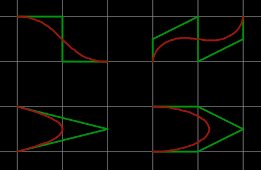

# BezierTrack KiCad Plugin

A KiCad plugin to bezier tracks.

Takes a standard track and turns it in to baked bezier curves.

Instructions
1. Select a single track (click on a single segment and press i)
2. Run plugin

To-do:
* automatically calculate number of points based on distance of bezier
* add some kind of UI to choose number of points
* make it work with multiple tracks at once
